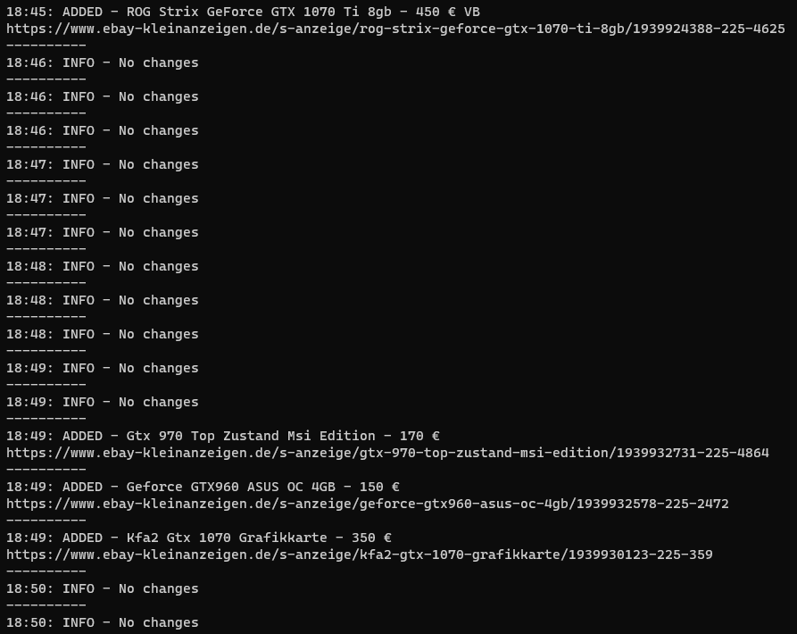

# eBay_Kleinanzeigen-Crawler

## Args
 ```
usage: Main.py [-h] --url URL [--output_json OUTPUT_JSON] [--file_name FILE_NAME] [--output_folder OUTPUT_FOLDER]
               [--proxy PROXY] [--sleep SLEEP] [--cache CACHE] [--log_level LOG_LEVEL]
               [--log_date_format LOG_DATE_FORMAT]

Website monitor

options:
  -h, --help            show this help message and exit
  --url URL             Website which will be monitored (default: None)
  --output_json OUTPUT_JSON
                        Cache to json (default: 0)
  --file_name FILE_NAME
                        File name (default: out)
  --output_folder OUTPUT_FOLDER
                        Output folder (default: data/)
  --proxy PROXY         Use proxy (default: 0)
  --sleep SLEEP         Time (secs) between requests (default: 25)
  --cache CACHE         Cache size (default: 50)
  --log_level LOG_LEVEL
                        Log level (default: 0)
  --log_date_format LOG_DATE_FORMAT
                        Logger date format (default: %H:%M)
 ```

## Example
 ```
py Main.py --url https://www.ebay-kleinanzeigen.de/s-pc-zubehoer-software/grafikkarten/anzeige:angebote/gtx/k0c225+pc_zubehoer_software.art_s:grafikkarten
 ```



